# Deeper

  
  
  
  
  
  
  

A puzzle roguelike for the Game Boy Advance. Dwarves dig their way down through the underground, run after
run: about thirty rooms of logic puzzles, fights, and encounters on a branching map, from the surface
to the core of the earth.

<table align="center">
  <tr>
    <td align="center">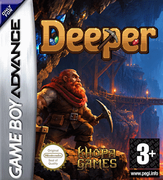</td>
    <td align="center"></td>
  </tr>
  <tr>
    <td align="center"><em>The box art</em></td>
    <td align="center"><em>A complete 15-layer descent, surface to core, recorded from mGBA (<code>make fullrun</code>)</em></td>
  </tr>
</table>

## Screenshots

<table align="center">
  <tr>
    <td align="center">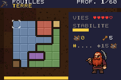</td>
    <td align="center">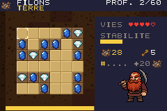</td>
    <td align="center">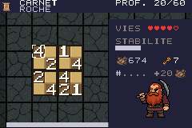</td>
  </tr>
  <tr>
    <td align="center"><em>Dig site</em></td>
    <td align="center"><em>Ore vein</em></td>
    <td align="center"><em>Prospector ledger</em></td>
  </tr>
  <tr>
    <td align="center">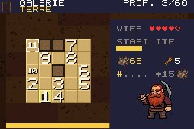</td>
    <td align="center">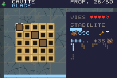</td>
    <td align="center">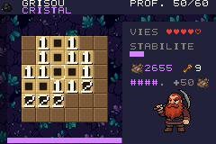</td>
  </tr>
  <tr>
    <td align="center"><em>Gallery</em></td>
    <td align="center"><em>Cavity and its tray of blocks</em></td>
    <td align="center"><em>Firedamp face</em></td>
  </tr>
  <tr>
    <td align="center">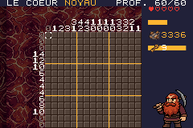</td>
    <td align="center">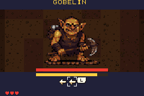</td>
    <td align="center">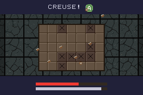</td>
  </tr>
  <tr>
    <td align="center"><em>The core: a picture in the ore</em></td>
    <td align="center"><em>A goblin, key sequences against its attack bar</em></td>
    <td align="center"><em>The wall: hammer A before the clock runs out</em></td>
  </tr>
  <tr>
    <td align="center">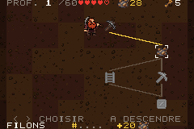</td>
    <td align="center">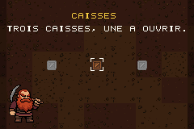</td>
    <td align="center">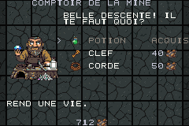</td>
  </tr>
  <tr>
    <td align="center"><em>The map: choose the next room</em></td>
    <td align="center"><em>Three crates, one to open</em></td>
    <td align="center"><em>The merchant at a camp</em></td>
  </tr>
</table>

## Build

Pure C on devkitARM + libtonc, no assembler. Requires MSYS2 shell with devkitPro
installed (`DEVKITPRO=/opt/devkitpro`), and Python 3 with Pillow on the PATH. mGBA is required to run tests.

    make            # build/deeper.gba
    make test       # host unit tests (rules, solvers, generators, engine logic)
    make emutest    # scenarios played in mGBA (needs a build with --script)
    make check      # both
    make puzzles    # regenerate data/puzzles/*.bin (deterministic seeds)
    make assets     # redraw the placeholder PNGs
    make run        # launch in mGBA

## How it was made

| | |
|---|---|
| **Code** | [Claude Opus 5](https://claude.com) (*High* reasoning, Claude Pro plan), a single conversation from the first line to this README |
| **Music** | [Suno](https://suno.com) (Pro licence) |
| **Graphics** | [PixelLab](https://pixellab.ai) (Pixel Apprentice tier) |

Everything was then tuned by hand: game design, balance and pixel art.

## Controls

| Key | Map | Room |
|---|---|---|
| D-pad | choose the next room | move the cursor |
| A | descend | primary action (dig, ore, symbol, block, next gallery cell) |
| B | | secondary action (note, erase, back up; cavity: next block) |
| L | | use a hint token |
| R | | family action (cavity: turn the block; a ghost shows where it lands) |
| SELECT | | rules of the room and its controls |
| START | descend | pause menu (resume, give up for a life, save and quit) |

The game is in French, English, Spanish and German; the language is asked at every boot
(the last choice is preselected), then the title picture leads to the menu:
Continue, New descent, Counter, Logbook, Options (sound, language).

## Repository

    common/          puzzle rules, packing and solvers, shared by the ROM, the generator and the tests
    source/          GBA engine: screens, rendering, save, run map, one adapter per family
    include/         headers
    tools/puzzlegen/ PC generator (one file per family) -> data/puzzles/*.bin
    tools/           png2gba.py, bin2c.py, make_assets.py
    assets/          source art: drawn sheets (high-res/, nodes/, dwarf/, tiles), music, marketing/ (the cover)
    data/puzzles/    committed puzzle banks (docs/puzzle_bank.md)
    tests/unit/      host tests; tests/emu/ mGBA scenarios (tests/README.md)
    docs/            design notes (French), formats, asset pipeline

Design notes: [docs/design.md](docs/design.md) (French).

## Licence

MIT.
