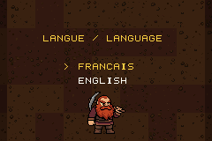

# Deeper

  
  
  
  
  
  
  

A puzzle roguelike for the Game Boy Advance, spin-off of *Dwarves Manager*
(Android, 2013). Dwarves dig their way down through the underground, run after
run: about thirty rooms of logic puzzles on a branching map, from the surface
to the core of the earth.

*Version française : [README.fr.md](README.fr.md).*

*A complete 15-layer descent from the surface to the core, recorded from mGBA (`make fullrun`).*

## What is in the ROM

- **Six kinds of rooms**, one visual identity: dig sites (one dig per row,
  column and rock, never touching), ore veins to balance, prospector ledgers
  (each symbol once per row, column and zone), continuous galleries through
  every cell with numbered exits, cavities to fill with stone blocks (from
  layer 25), and small firedamp faces to clear without breaking a pocket
  (from layer 10). Crates nodes offer one of three boxes. The core itself is a seventh kind,
  played nowhere else: a picture hidden in the ore, clued by the run lengths
  of every row and column, that lights up when complete (10 × 10, 12 × 12 or
  15 × 15 with the length of the descent).
- **A branching descent** of 15, 30 or 60 layers (longer descents unlock by
  reaching the core of the shorter one): at each node the map shows the next
  rooms with their type, a difficulty gauge and their reward (ore, an extra
  hint, a life, a risky room paying double, a camp to rest). Difficulty rises
  in a sawtooth and always starts gently.
- **Against the clock**: a bar under each puzzle drains over the room's time
  budget; the faster the room is cleared, the bigger the ore bonus (up to
  doubling the reward). Each run's total time is kept, with a best time per
  descent length in the logbook.
- **Run resources**: lives, hint tokens, ore. A conflict left standing for
  two seconds spends one point of the room's stability (with a small burst);
  fixing it in time is free. An empty budget caves the room in and costs a
  life. Hints apply one real deduction step, never the whole solution.
- **Barnaby's counter**: a merchant dwarf keeps every camp (a hint, a life or
  a prop for the next room, paid with the run's ore) and his counter on the
  title menu, where the ore brought back buys permanent gear (satchel,
  bedroll for more maximum lives, flask for more starting lives, a three-level
  lantern for more time) and cosmetics for your dwarf. You start every descent
  with a single life.
- **Permanent progression**, earned only by playing: stats, a logbook and
  three powers unlocked by milestones (an extra hint per run, an extra life,
  a free first cave-in).
- **Six biomes** down the descent, each with its own backdrop behind the
  rooms and the map.
- **Battery saves**: the run in progress (down to the board, cursor and
  counters of the current room) and the permanent profile are two
  independent, checksummed SRAM blocks. *Continue* reopens the exact room.
- **Puzzle banks** generated on the PC: every puzzle has a single solution,
  a measured 1–10 difficulty and no near-duplicate under the symmetries of the
  square. ~1760 puzzles across five families, 60 KB of ROM.

Art cut from the concept sheet (`assets/concept_sheet.png`, imported by
`tools/import_concept.py`), PSG sound effects and music converted from
*Dwarves Manager* for now; the pipeline is built so final art and WAV tracks
replace them without code changes ([docs/assets.md](docs/assets.md)).

## Build

Pure C on devkitARM + libtonc, no assembler. From an MSYS2 shell with devkitPro
installed (`DEVKITPRO=/opt/devkitpro`), Python 3 with Pillow on the PATH:

    make            # build/deeper.gba
    make test       # host unit tests (rules, solvers, generators, engine logic)
    make emutest    # scenarios played in mGBA (needs a build with --script)
    make check      # both
    make puzzles    # regenerate data/puzzles/*.bin (deterministic seeds)
    make assets     # redraw the placeholder PNGs
    make run        # launch in mGBA

## Controls

| Key | Map | Room |
|---|---|---|
| D-pad | choose the next room | move the cursor |
| A | descend | primary action (dig, ore, symbol, block, next gallery cell) |
| B | | secondary action (note, erase, back up; cavity: next block) |
| L | | use a hint token |
| R | | family action (cavity: turn the block; a ghost shows where it lands) |
| SELECT | | rules of the room and its controls |
| START | descend | pause menu (resume, give up for a life, save and quit) |

The game is in French and English; the language is asked at every boot
(the last choice is preselected), then the title picture leads to the menu:
Continue, New descent, Counter, Logbook, Options (sound, language).

## Repository

    common/          puzzle rules, packing and solvers, shared by the ROM, the generator and the tests
    source/          GBA engine: screens, rendering, save, run map, one adapter per family
    include/         headers
    tools/puzzlegen/ PC generator (one file per family) -> data/puzzles/*.bin
    tools/           png2gba.py, bin2c.py, make_assets.py
    assets/          source PNGs (placeholders)
    data/puzzles/    committed puzzle banks (docs/puzzle_bank.md)
    tests/unit/      host tests; tests/emu/ mGBA scenarios (tests/README.md)
    docs/            design notes (French), formats, asset pipeline

Design notes: [docs/design.md](docs/design.md) (French).

## Licence

MIT.
